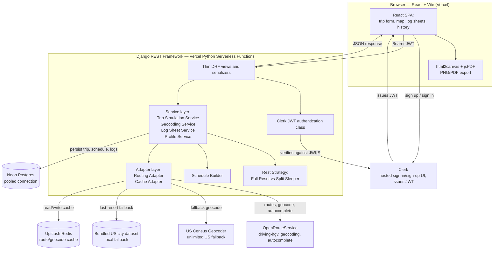
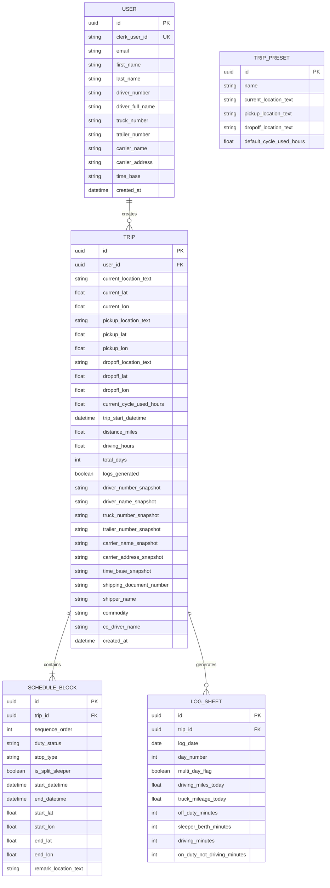

# Spec

This is the technical specification for the trip-planning and driver-log app described in overview.md, assumptions.md, and rulebook.md. Those three documents describe what the app does and why. This document describes how it is built.

## 1. Purpose, in one paragraph

A truck driver signs in, enters a trip (current location, pickup, dropoff, hours already used in their cycle), and immediately sees a color-coded route map with a full trip breakdown, before they have to type anything else. If they want the official daily log paperwork for that trip, they provide the remaining driver/vehicle details and the app generates properly formatted, exportable log sheets. Every trip and every generated log is saved to their account history.

## 2. Tech stack, locked in

| Layer | Choice | Why |
|---|---|---|
| Frontend hosting | Vercel (Hobby) | Free, hosts the React build and the Django functions on one platform |
| Frontend framework | React + Vite | Matches the assessment's "React" requirement |
| Backend | Django + Django REST Framework, deployed as Vercel Python serverless functions (WSGI) | Matches the assessment's "Django" requirement; officially supported Vercel deployment path as of 2026; same origin as the frontend, no CORS setup needed |
| Auth | Clerk (`@clerk/clerk-react` on the frontend, JWT verified by DRF on the backend) | Free up to 50,000 monthly retained users; handles email/password and Google sign-in out of the box |
| Database | Neon Postgres, accessed through its pooled connection string | Permanent free tier, no expiry; pooling is required because serverless functions each open a fresh connection |
| Cache | Upstash Redis, via `django-redis` | Permanent free tier (256MB, 500K commands/month); used to cache routing/geocoding results |
| Routing, HGV-aware directions, geocoding, autocomplete | OpenRouteService (`driving-hgv` profile) | Free forever, no card; only free option with a real truck routing profile (height/weight/length restrictions); dedicated autocomplete quota separate from regular geocoding |
| Address fallback / unlimited reverse geocoding | US Census Bureau Geocoder | Free, no rate limit, no API key, US-only (matches this app's scope exactly) |
| Local fallback for stop labeling | Bundled static dataset of US cities/towns (Census Gazetteer data) | Used if a live reverse-geocode call fails; snaps a stop to the nearest known city by distance |
| PNG/PDF export | `html2canvas` + `jsPDF`, entirely client-side | Free, no server rendering cost, no headless-browser process needed |

Everything above runs at $0/month within each service's free tier for personal/demo-scale traffic.

## 3. Architecture diagram

## 4. The two-phase trip flow

This is the core interaction model, and it drives the schema and the API design below.

**Phase 1 — Generate Trip (minimal inputs).** The user provides only: current location, pickup location, dropoff location, current cycle used (hours), and trip start date/time (defaults to 6:00 AM, editable). The backend runs the full HOS simulation on coordinates alone — no driver/carrier details are needed yet, because none of that information affects where the truck goes or when it has to stop. The response is the route map, the color-coded stop markers with a legend, and the trip breakdown (distance, driving hours, days, time in each duty status, number of rests, number of fuel stops). This is persisted immediately as a `Trip` with `logs_generated = false`, so it already shows up in the user's history even if they go no further.

**Phase 2 — Generate Logs.** If the user wants the official paperwork, they confirm (or edit) their driver/carrier profile defaults and provide the two remaining trip-specific fields (shipping document number, or shipper name and commodity; co-driver name). The backend reverse-geocodes the stop coordinates into city/state remarks (batched, with the fallback chain described in Section 3), snapshots the profile fields onto the `Trip` record, computes one `LogSheet` row per calendar day, and sets `logs_generated = true`.

The reason for snapshotting rather than always reading live profile data: a generated daily log is meant to be an immutable record of what was true at the time it was issued. If the user edits their driver profile next month, trips they already generated logs for shouldn't silently change.

## 5. Database schema

Notes on specific fields:

- `USER` fields other than `clerk_user_id`, `email`, `first_name`, `last_name` are the driver/carrier profile defaults — set once by the user, editable any time, and copied ("snapshotted") onto a `Trip` only when that trip's logs are generated.
- `duty_status` on `SCHEDULE_BLOCK` is one of the four values from rulebook.md: off duty, sleeper berth, driving, on duty not driving.
- `stop_type` on `SCHEDULE_BLOCK` distinguishes what kind of event a block represents for map-legend and log-grid purposes: driving leg, pickup, dropoff, fuel stop, 30-minute break, 10-hour rest, or 34-hour restart. `is_split_sleeper` flags whether a 10-hour rest is one half of a split pair (per the sleeper-berth-split rule), so the map legend can label it distinctly from a full continuous reset.
- `remark_location_text` starts empty at Phase 1 (simulation only needs coordinates) and is filled in during Phase 2's batch reverse-geocoding step.
- `TRIP_PRESET` is a small seed table (a handful of popular routes) with no foreign key to any trip — selecting one just pre-fills the Phase 1 form.
- The current location itself isn't a `SCHEDULE_BLOCK` row; it's rendered on the map directly from `TRIP.current_lat`/`current_lon`.

## 6. API design (thin DRF layer)

| Endpoint | Method | Purpose |
|---|---|---|
| `/api/trips/` | POST | Phase 1: run the simulation on the four minimal inputs, persist the `Trip` and its `SCHEDULE_BLOCK`s, return the route, stops, and trip breakdown |
| `/api/trips/` | GET | List the signed-in user's trip history |
| `/api/trips/{id}/` | GET | Full detail for one trip: route, schedule blocks, and log sheets if generated |
| `/api/trips/{id}/generate-logs/` | PATCH | Phase 2: accept the trip-specific fields, snapshot the profile, batch-reverse-geocode stops, compute `LOG_SHEET` rows, set `logs_generated = true` |
| `/api/presets/` | GET | List the available trip presets |
| `/api/profile/` | GET / PATCH | Read or update the signed-in user's driver/carrier profile defaults |

Every endpoint except `/api/presets/` requires a `Authorization: Bearer <clerk-jwt>` header. Views and serializers only validate input shape and format output; all HOS and scheduling logic lives in the service layer below them, so it stays unit-testable without spinning up the framework.

## 7. Service layer and design patterns

- **Trip Simulation Service** — owns the day-by-day walk through a trip, applying the rulebook.md limits (11-hour, 14-hour, 70-hour, 30-minute break, 34-hour restart) and producing the ordered list of `SCHEDULE_BLOCK`s.
- **Rest Strategy (Strategy pattern)** — a `RestStrategy` interface with two implementations, `FullResetStrategy` and `SplitSleeperStrategy`. The simulation service asks the strategy layer to pick whichever produces a valid, more time-efficient trip, per the split-sleeper-berth rule.
- **Schedule Builder (Builder pattern)** — assembles the block-by-block timeline incrementally as the simulation proceeds, rather than the simulation service building a raw list by hand.
- **Routing Adapter (Adapter pattern)** — one interface wrapping OpenRouteService, the US Census Geocoder, and the bundled city-fallback dataset, so the simulation and geocoding services never call a vendor SDK directly. This is what makes the fallback chain in Section 3 swappable later without touching business logic.
- **Cache Adapter** — thin wrapper around `django-redis`, used by the Routing Adapter to cache route and geocoding results by location pair, protecting the OpenRouteService daily quota.
- **Geocoding Service** — runs the Phase 2 batch reverse-geocode step described in Section 4.
- **Log Sheet Service** — aggregates a trip's `SCHEDULE_BLOCK`s into per-day `LOG_SHEET` rows and performs the profile-field snapshot.
- **Profile Service** — reads and updates the driver/carrier defaults on `USER`.

No background job queue (Celery or similar) is used. The simulation is fast and deterministic enough to run synchronously inside the request/response cycle, and a queue would need a persistent worker process, which defeats the free-tier goal for no real benefit at this scale.

## 8. Frontend UX requirements

- **Trip form**: tooltips on every input explaining what it means and why it's needed; the "Current Cycle Used (Hrs)" field offers both a numeric input and a slider (0–70); a "Popular trips" preset picker lets the user skip manual entry by choosing a predefined route, which pre-fills the Phase 1 form (still editable before submitting).
- **Map**: color-coded markers for current location, pickup, dropoff, fuel stops, 30-minute breaks, 10-hour rests (full and split shown distinctly), and 34-hour restarts, with a legend explaining each color/icon.
- **Trip breakdown panel** (shown immediately after Phase 1): distance, total driving hours, number of days, time spent in each duty status, number of rest periods, number of fuel stops.
- **Log sheets** (shown after Phase 2): rendered as SVG so the grid lines are pixel-precise and the remarks text can use a true 45-degree rotation (`transform="rotate(-45 x y)"`) rather than an approximation — laid out to read as a proper official DOT-style form, with the header fields, the 24-hour four-row grid, and the remarks all present as specified in rulebook.md. A multi-log-sheet trip also shows summary stats across all sheets (date range, total driving time, total distance covered).
- **Export**: buttons to export any log sheet as PNG or PDF, generated client-side from the rendered SVG.
- **History**: a list of past trips (both Phase-1-only previews and fully generated ones), each reopenable to view the map, breakdown, and — if generated — the log sheets again.

## 9. Known trade-offs, stated plainly

- Vercel's Python serverless functions cold-start on the first request after idle; this is generally lighter than a fully-stopped container, but a Django app importing on a cold invocation is still slower than a warm one. Acceptable at this scale; would need a paid always-on tier to eliminate entirely.
- OpenRouteService's free tier caps at 2,000 routing requests and 1,000 geocoding/autocomplete requests per day. The Redis cache and the Census Bureau fallback are both there specifically to keep real usage well under those ceilings.
- Neon's free tier scales to zero on idle and caps at 0.5GB storage — ample for trip/log history at personal scale, but worth knowing if this ever needs to support many concurrent users.
